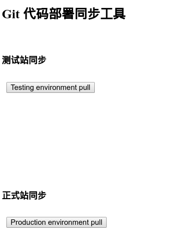
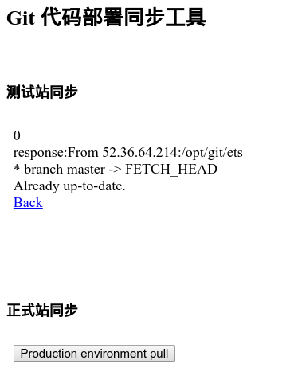

# 代码快捷同步到测试站以及正式站工具.
### 实现机制

* Git
* Python Flask 环境
* supervisor

### 操作示意图1


### 操作示意图2



_____

###使用方法

1. 部署一个远程git仓库, 确保各个服务器均能访问.并且与各个服务器配置好 
	* 迁移本地git仓库至远程服务器,可直接将本地服务器仓库的 projectxxx.git 打包传输到远程服务器再解压.所有日志和改动都会被保留下来. 
	* [无密码访问设置](http://blog.csdn.net/haigenwong/article/details/7410914) 
2.  Python 出发git pull 脚本设置
	* 安装python
	* 安装flask
	* [python web 脚本](dogit.py). 
	* 运行 ``python dogit.py``
	* 此时浏览器访问 IP:5000 即可成功使用python 做 同步操作.
3.  gunicorn 管控flask 执行.
	* 安装gunicorn
	* 运行
	```
	gunicorn -w4 -b0.0.0.0:5000 dogit:app &
	# -b 设置 ip 以及端口
	# -w 设置线程数
	# dogit 为需要后台执行的 py文件名
	# :app Flask 声明的变量名称 app = Flask(__name__)
	```
	* 停止 
	```
		kill -9 `ps aux |grep gunicorn |grep dogit | awk '{ print $2 }'`
	```
	
4. html iframe 控制两个服务器 [deploy.html](deploy.html)
	 
####可能遇到的问题

1. Python 通过 ``commands.getstatusoutput`` 方法获取执行``pull origin develop``后的返回信息.输入到html上. ``o.system``只能执行不能看到返回的信息
2. ``app:run(host="0.0.0.0",port="5000")`` 此处默认host 为127.0.0.1 port 为5000 . 若只是简单的通过flask辅助操作linux 命令，不建议配置nginx. 直接使用就好, 所以host 为远程IP 最好设置成 ``0.0.0.0``
3. ``python dogit.py &``后台运行后退出控制台就会中断. 
	 通过 ``nohup python dogit.py &`` 执行可达到效果,但是由于是单进程,容易出现卡死不响应情况.
	 所以通过supervisor 实现多线程可以保证 flask 更稳定的运行.
4. 网上说的Python bug 也会导致访问卡死和不响应, 我根据做了调整,好像还是会出现同样的问题.最后通过配置supervisor才解决.
	Python Lib 下``SocketServer.py``第715行的pass改为
```
	 self.wfile._wbuf = []
	 self.wfile._wbuf_len = 0
	 
```
原链接：https://bugs.python.org/file40772/clear_buffer_on_error.patch
